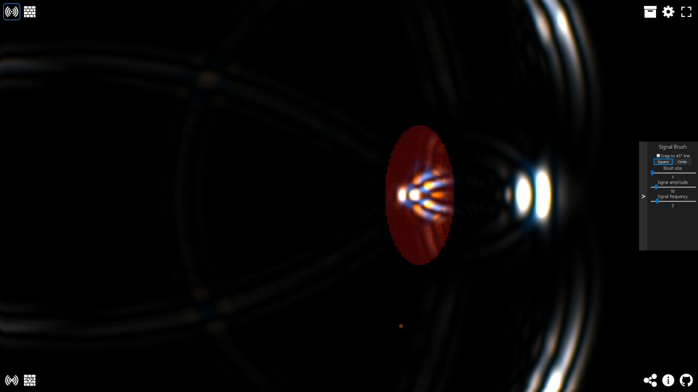

# Electromagnetic wave simulation
[Live version at cemsim.com](https://cemsim.com/)

An interactive web-based simulator of electromagnetic waves. Simulation done using the finite-difference time-domain method.



Found any bugs, have suggestions or anything else? Open an issue or [contact me](mailto:tora@warlock.ai).

Technology used among others: [React](https://reactjs.org/), [TypeScript](https://www.typescriptlang.org/), [regl](https://github.com/regl-project/regl).

# Getting started
To launch this web-app yourself, first install [Node](https://nodejs.org/en/download/) if you haven't. Next clone or download this repository, type `npm install` and then `npm start`.
The project was created using [Create React App](https://github.com/facebook/create-react-app) so all its commands are also available.

# Project structure overview
- [src/App.tsx](src/App.tsx) Main react app used to display the website
- [src/em/simulator.ts](src/em/simulator.ts) Simulator that calls the WebGL kernels for ... simulation
- [src/em/kernels/simulation.ts](src/em/kernels/simulation.ts) WebGL kernels used for simulation
- [src/em/rendering.ts](src/em/rendering.ts) Renders the simulation to a canvas
- [src/em/kernels/rendering.ts](src/em/kernels/rendering.ts) WebGL kernels used for rendering

# How the simulation works / an intro to simulating Maxwell's equations
The electromagnetic field is described by [Maxwell's equations](https://en.wikipedia.org/wiki/Maxwell%27s_equations). In their most common form
they state that there exists an electric and a magnetic field. The equations describe how those two fields evolve over time and affect each other.
Their macroscopic version also takes into account materials which are specified by their relative [permittivity](https://en.wikipedia.org/wiki/Permittivity) and
relative [permeability](https://en.wikipedia.org/wiki/Permeability_(electromagnetism)).

Maxwell's equations exist in the continuous form as integral or differential equations and we will use their differential form.
For simulation we have to discretize. We start with the equations in differential form and replace differentiation by finite differences,
for example `d/dt X(t)` becomes `(X_t+1 - X_t) / dt`. We can then solve such an equation for `X_t+1` to obtain an update equation which we can use to update our fields.
We also have to discretize space itself which we do by specifying a discrete grid. At each grid cell location we store the values of
the two fields and the material parameters. This type of simulation is called a [finite-difference time-domain (FDTD) method](https://en.wikipedia.org/wiki/Finite-difference_time-domain_method).
As we only display two dimensions in this simulation we can further simplify these equations by taking all spatial derivatives in the `Z` direction to be zero.
This will get rid of some terms when calculating the `curl`.

With this information we can derive all the equations we need for simulation. We can use a Yee grid to automatically satisfy Gauss's law and Gauss's law for magnetism
(see [here (pdf warning)](https://empossible.net/wp-content/uploads/2019/08/Lecture-4b-Maxwells-Equations-on-a-Yee-Grid.pdf)).
Here we make the magnetic field grid exist at a `0.5 * cell size` offset from the electric field grid.
Now we can discretize the Fadaray's and Ampère's law to obtain the update equations for the magnetic and electric fields respectively.

Update equations for Faraday's law which will give us the magnetic field given the electric field and the previous magnetic field:
```
Definitions
    X: position 3-vector
    X/Y/Z_hat: unit 3-vector in X/Y/Z direction
    x, y, z: individual position coordinates
    t: time
    E: electric field
    B: magnetic field
    d/dt: time-derivative operator
    dx/y/z: Spatial grid cell size
    dt: Time step size

1. Faraday's law
    curl E(X, t) = -d/dt B(X, t)

2. Write out curl and individual vector components
    d/dy E_z(X, t) - d/dz E_y(X, t) = -d/dt B_x(X, t)
    d/dz E_x(X, t) - d/dx E_z(X, t) = -d/dt B_y(X, t)
    d/dx E_y(X, t) - d/dy E_x(X, t) = -d/dt B_z(X, t)

3. Set Z-derivatives (d/dz) to zero
    d/dy E_z(X, t) = -d/dt B_x(X, t)
    -d/dx E_z(X, t) = -d/dt B_y(X, t)
    d/dx E_y(X, t) - d/dy E_x(X, t) = -d/dt B_z(X, t)

4. Discretize curl and time-derivative
    (E_z(X + Y_hat * dy, t) - E_z(X, t)) / dy = (B_x(X, t) - B_x(X, t+1)) / dt
    -(E_z(X + X_hat * dx, t) - E_z(X, t)) / dx = (B_y(X, t) - B_y(X, t+1)) / dt
    (E_y(X + X_hat * dx, t) - E_y(X, t)) / dx - (E_x(X + Y_hat * dy, t) - E_x(X, t)) / dy = (B_z(X, t) - B_z(X, t+1)) / dt

5. Solve for B(X, t+1):
    B_x(X, t+1) = -dt * ((E_z(X + Y_hat * dy, t) - E_z(X, t)) / dy)
    B_y(X, t+1) = -dt * ((E_x(X + Z_hat * dz, t) - E_x(X, t)) / dz)
    B_z(X, t+1) = -dt * ((E_y(X + X_hat * dx, t) - E_y(X, t)) / dx - (E_x(X + Y_hat * dy, t) - E_x(X, t)) / dy)
```

We can do exactly the same procedure for Ampère's law which yields the update equations for the electric field given the magnetic field and the previous electric field.

A great lecture series on YouTube about this and more was created by CEM Lectures and can be found [here](https://www.youtube.com/watch?v=KHTByojnsZE&list=PLLYQF5WvJdJWoU9uEeWJ6-MRzDSziNnGt).

Finally in this simulation we also take into account conductivity (ie. loss). The modification to the equations for this can be found
[here (pdf warning)](https://www.research-collection.ethz.ch/bitstream/handle/20.500.11850/151102/eth-41633-02.pdf) at the beginning of
chapter 5 (page 53 equations 5.1a and 5.1b).

The code for all of this is implemented in WebGL shaders for quick parallel computation and can be found [here](src/em/kernels/simulation.ts).

# Acknowledgements
- [Icons8](https://icons8.com/) for icons
